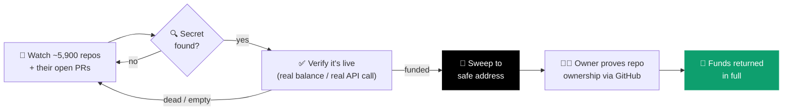
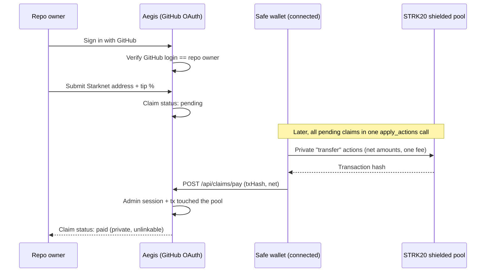

# Aegis

**A whitehat rescue bot for exposed on-chain funds on Starknet.**

Aegis watches public repos for accidentally committed private keys and API
keys, verifies whether they're actually live and actually holding funds —
not just pattern-matching — and sweeps anything real to a safe address
before an attacker gets there first.

[](https://aegis-peach-six.vercel.app/)
[](https://strk20.starknet.io/hackathon)
[](https://voyager.online/)
[](https://sepolia.voyager.online/)
[](https://nextjs.org)
[](LICENSE)

**[→ aegis-peach-six.vercel.app](https://aegis-peach-six.vercel.app/)**

---

## The problem

Shipping fast means leaking things. A `.env` gets committed, a hardhat
config keeps a real deployer key, a demo repo goes public with a funded
testnet account still inside it. The moment that key is on GitHub, it's
already been scraped — bots harvest leaked keys within minutes.

Aegis is the whitehat version of that bot.

## How it works



1. **Detect** — three passes over three different populations of repository:
   - the [STRK20 hackathon registry](https://github.com/starkience/strk20-hackathon), scanned on a fast loop — this is the only pass allowed to move funds on mainnet;
   - the **wider Starknet ecosystem**, ~5,700 repositories found through GitHub search and kept in a work queue, swept in slices;
   - **open pull requests**, because a secret is just as exposed in a branch that was never merged as in one that was.

   Each pass reads the known-sensitive paths (`.env`, `hardhat.config.*`, `foundry.toml`, …) straight from the raw CDN, so scanning thousands of repositories costs no API quota at all.
2. **Verify** — a leaked string alone isn't a finding, and this is where most scanners generate noise. Every candidate goes through three gates: a Gitleaks-style regex and Shannon-entropy pre-filter run in memory, then a **cryptographic check** that the value is a valid private key on the Stark curve (in range, and it derives a public key), then an RPC balance query on the derived account. Provider credentials — GitHub tokens, Alchemy keys, and others — get one minimal read-only call to confirm they're live. Nothing is treated as urgent unless the funds are real.
3. **Rescue** — if a leaked key controls real funds, Aegis derives the Starknet account it owns (private keys don't map to one address the way they do on EVM chains — this is solved on-chain, not guessed), deploys the account if needed, and sweeps the balance to a safe holding address.
4. **Return** — the original owner signs in with the GitHub account that owns the repository, connects the address they want paid, and files a claim. Claims are paid out as private transfers through the STRK20 pool, batched rather than instant — see below for why that ordering is the whole point.

No human in the loop between detection and rescue. Two GitHub Actions loops keep it running whether or not anyone is looking at the site: the registry scan every ~90 seconds, and the ecosystem sweep plus pull-request pass on a deliberately unhurried ~10 minute cycle. The pace is set by the real ceilings — GitHub's search quota and the RPC budget — not by a guess.

Keeping those loops *started* turned out to be the harder half. A `schedule:`
trigger is best-effort, and it degrades: starts here ran about 15 minutes apart
until it quietly stretched to 11–18 hours, which left the scanner up roughly 6%
of the day. Anything funded in a gap simply waited. Two things close it. Each
run now loops for 5h45m rather than 50 minutes, just inside the ceiling on a
single job — free on a public repository, and bounded by the same `SLEEP` that
governs RPC spend. And when a run ends it starts the next one itself, which
needs a personal access token: a `workflow_dispatch` authenticated with the
built-in `GITHUB_TOKEN` deliberately does not start a new run, so a workflow
cannot trigger itself by accident. Add a fine-grained token with Actions
read/write as the `LOOP_PAT` secret and the chain is continuous; without it the
step is a no-op and the schedule stays the only trigger. Any external cron that
can hit `/api/scan-registry` works just as well and depends on nothing GitHub
decides.

Anyone can also point it at a single repository from the site itself. That path is detect-only: it reports what it finds and puts the repository in the sweep queue, so a visitor who spots a funded leak gets it handled without the endpoint becoming a way to make the server spend money on request.

**Findings are masked.** The live console shows a hit as `b***/a****`, never the real name. Finding an exposed key on testnet almost always means the same key is exposed on mainnet, so publishing the repository name would hand an attacker the exact thing this project exists to prevent. The unmasked URL is kept server-side, where ownership verification needs it, and never reaches a page or an epoch record.

## Why privacy matters here

A sweep-and-return service is only as safe as its own holding address. A
transparent wallet is a target — anyone watching the mempool can front-run
the rescue or drain it the moment it's known publicly. Routing rescued
funds through the STRK20 shielded pool removes that window: the holding
balance isn't linkable on-chain, and payout to a verified owner is a
private transfer, not a public, front-runnable one.

## What a claim is backed by

A claim is only ever worth what the chain can account for. The rescue ledger
is Aegis writing down its own work, so before a figure is offered to an owner
every line in it is checked against its receipt: the transaction has to exist,
have succeeded, and have moved exactly that much STRK into the safe wallet —
and, for rescues that recorded which account they swept, have been sent by
that account. Lines that fail are reported as unproven and are not claimable.

Two things are then subtracted. The first is money with no victim behind it:
STRK the vault itself sent a leaked account and then swept back, faucet STRK,
and anything from an address declared in `NON_VICTIM_FUNDERS`. Sepolia's test
account was funded with 3,000 from the faucet and 900 from the vault, and none
of it was anyone's loss — asking a faucet for test funds is not the same as
losing your own, and money the vault sent itself would let it inflate what it
owes by paying itself. Funds traced to these have no rightful claimant: they
stay in the vault, they stay on the record, and no owner is offered them. A
request left with nothing behind it disappears from both panels rather than
sitting there as a number nobody can be paid. The second subtraction is the
vault's own capacity: a network's total is held under what the safe wallet
actually holds, minus what pending claims already promise; if it falls short,
every claimant's figure shrinks by the same proportion rather than the
shortfall landing on whoever asks last.

Together these are what stops a payout loop. Paying a claim never creates a new
one: claimable is the proven total minus everything already claimed or paid, so
a fresh figure appears only when someone actually funds a leaked wallet again —
and then it is genuinely theirs. Money the vault itself put there is netted
out, and nothing can be promised that the vault does not hold.

One case the funder check cannot reach: netting by address only works while the
money stays in one token. The mainnet fixture account took ETH from the vault
and swapped it into STRK, so the STRK arrived from a DEX router and nothing in
the transfer graph names Aegis as its source. Following value across swaps to
prove that is unbounded work and would still be a guess, so that funding is not
netted out — a rescue whose money reached the leaked account through a swap is
credited to the repository in full, and the balance cap is what keeps the total
inside what the vault actually holds.

The same check runs again at payout. A claim is priced when it is filed and
then waits, so what backs it can shrink in between; a request that no longer
holds up is kept out of the batch and shown with the reason.

What survives is money traceable to a specific leak in a specific repository.
The claim card shows that trail — the repo, the account the key derived to,
and each rescue transaction — alongside anything the figure was reduced by.
Whatever else is in the vault, including deposits that arrived from an address
tied to no repo at all, is nobody's to claim and is reported separately as
unattributed.

## Claim & payout flow

Payout is deliberately **not** automatic — paying a claim the instant it's
filed would pair a deposit with a withdrawal one-to-one, which is exactly
the correlation the shielded pool exists to prevent. Claims sit pending and
get paid out later, batched with others.



The address and tip percent can be edited freely while a claim is
`pending`; once `paid`, the record is immutable.

`/api/claims/pay` cannot verify much, and it's worth being precise about
why. A private transfer hides the from, the to, and the amount, and it also
hides the sending account — the `sender_address` on the receipt is
pool-internal, not the safe wallet. So the chain cannot answer "did my
wallet pay this particular claim". All the endpoint checks is that the
transaction is real, succeeded, and emitted an event from the pool; the
actual gate is an authenticated admin session. That is acceptable because
no funds pass through this endpoint — it is bookkeeping. A forged call
could only corrupt a record, never move money, since nothing reaches a
claimant without a real wallet-signed transfer.

One thing worth saying plainly, because it surprises people: a private
payout lands in the recipient's **shielded** balance. It will not appear in
their public wallet balance at all until they unshield.

## What's actually working right now

- ✅ **~5,900 repositories under watch** — the 152 registered sprint projects plus ~5,700 Starknet repositories discovered through search, swept continuously alongside their open pull requests
- ✅ Verified detection — entropy pre-filter, Stark-curve validation, then a real balance check; provider credentials confirmed live with one read-only call, not matched by regex and hoped for
- ✅ Private-key → funded-account derivation with zero manual input
- ✅ Findings masked end-to-end, so the scan never publishes the exposure it just found
- ✅ Public self-serve scan — anyone can check their own repository from the site, detect-only
- ✅ Automatic sweep to a safe address, running in the wild on **both Sepolia and mainnet** with real funds — 5 accounts recovered on mainnet and 17 on Sepolia so far, including keys the ecosystem sweep found in the wild rather than in our own test fixture; mainnet example: [`0x13fc35b0…afe083fd`](https://voyager.online/tx/0x13fc35b018ddc48f86f40f5966330e03fe2e2a235bf795e61c83004afe083fd), [`0x4607b8bb…d99698d`](https://voyager.online/tx/0x4607b8bbc7bf6ef58a0fbde6d0a065143530aa9c267f4042d5188382d99698d). The ecosystem sweep is restricted to testnet on purpose: mainnet rescue stays on the registry pass, where the projects opted into being watched.
- ✅ GitHub-verified claims — a repo owner signs in, we check their login against the repo's owner segment and the rescue ledger, they register a Starknet address
- ✅ Payout through the real STRK20 shielded pool (mainnet, `strk20.json`), not a plain transfer — safe wallet registers, shields, and pays a claim out as a private note-to-note transfer (no amount, no parties on-chain); a claim sits pending until it's paid this way, deliberately batched with others rather than instant, since an isolated deposit-then-withdraw pair is the one thing actually correlatable in this scheme
- ✅ Batched payouts through a single `apply_actions` call — the pool charges its 6 STRK fee once per call rather than once per transfer, so every pending claim on a network is paid in one transaction and shares one fee, prorated across the claims instead of charged to each. Recipients are checked for pool registration on-chain first, so an unregistered address is skipped rather than reverting the whole batch. See [docs/FINDINGS.md](docs/FINDINGS.md).
- 🚧 Fully automatic private payout — right now the shield/private-transfer step needs a connected wallet (no mainnet proving service is publicly available yet for a headless signer; see [issue #124](https://github.com/starkience/strk20-hackathon/issues/124)), so it's a deliberate manual step rather than instant

## Field notes

Integrating with the STRK20 pool turned up a number of things that aren't
documented anywhere — the fee is charged per `apply_actions` call rather than
per transfer, registration status is readable straight off the chain, a
headless signer can't shield at all, and a private key doesn't determine an
address on Starknet.

**[→ docs/FINDINGS.md](docs/FINDINGS.md)** writes all of it up, with the
mainnet call or transaction that verifies each one. If you're building on the
pool, start there — it's the afternoon we already lost.

## Stack

- **Next.js 16** (App Router) + **React 19** + **TypeScript**
- **starknet.js v10** — RPC, account derivation, deploy + sweep, on both Sepolia and mainnet
- **get-starknet** — wallet connection (Argent/Ready) for the STRK20 pool panel
- **AVNU SDK** — whitelisted-token → STRK swaps before a sweep, and quote/execute for the shield/send/unshield panel
- **Cairo** (`cairo/`, Scarb) — `StrkInvokeHelper`, deployed on mainnet, exercises the pool's withdraw → invoke → open-note flow
- **next-auth v5** — GitHub OAuth, verifies repo ownership for claims
- **Tailwind CSS**

## Running locally

```bash
npm install
cp .env.example .env.local     # add your Alchemy Starknet RPC key + a safe address
npm run dev                    # http://localhost:3000
```

Without an Alchemy key, the scanner still detects leaked secrets but skips
balance checks and rescues.

## Credits

UI built on top of the [STRK20 starter kit](https://github.com/Akashneelesh/strk20-starter-kit) (MIT).

## License

MIT, see [LICENSE](LICENSE).
