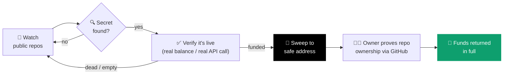
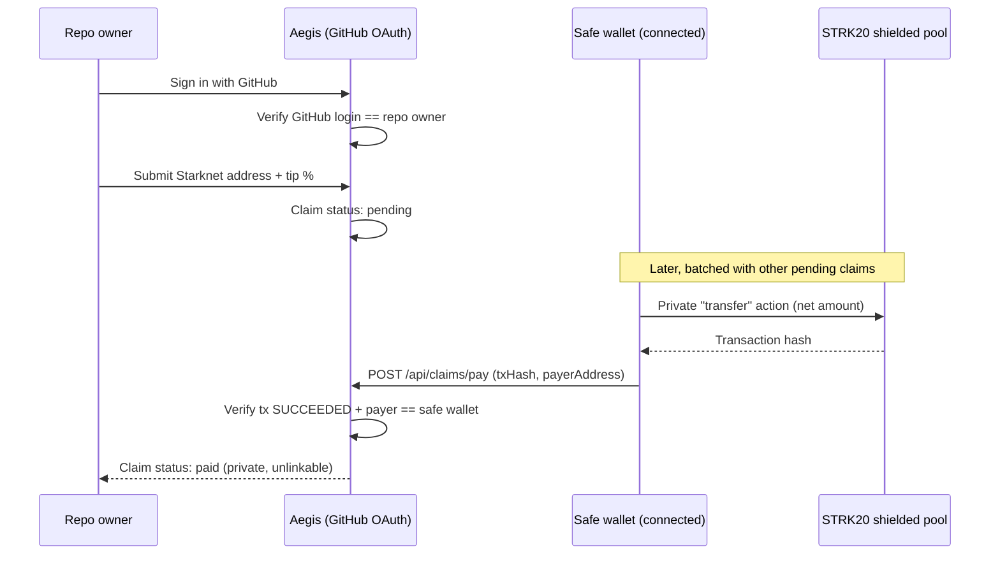

# Aegis

**A whitehat rescue bot for exposed on-chain funds on Starknet.**

Aegis watches public repos for accidentally committed private keys and API
keys, verifies whether they're actually live and actually holding funds —
not just pattern-matching — and sweeps anything real to a safe address
before an attacker gets there first.

[](https://aegis-peach-six.vercel.app/)
[](https://strk20.starknet.io/hackathon)
[](https://voyager.online/)
[](https://sepolia.voyager.online/)
[](https://nextjs.org)
[](LICENSE)

**[→ aegis-peach-six.vercel.app](https://aegis-peach-six.vercel.app/)**

---

## The problem

Shipping fast means leaking things. A `.env` gets committed, a hardhat
config keeps a real deployer key, a demo repo goes public with a funded
testnet account still inside it. The moment that key is on GitHub, it's
already been scraped — bots harvest leaked keys within minutes.

Aegis is the whitehat version of that bot.

## How it works



1. **Detect** — scans every project registered in the [STRK20 hackathon registry](https://github.com/starkience/strk20-hackathon) for known-sensitive filenames (`.env`, `hardhat.config.*`, `foundry.toml`, …).
2. **Verify** — a leaked string alone isn't a finding. Private keys are checked against real Sepolia balances; GitHub tokens and Alchemy keys get one minimal, read-only call to confirm they're actually live. Nothing gets flagged as urgent unless it's real.
3. **Rescue** — if a leaked key controls real funds, Aegis derives the Starknet account it owns (private keys don't map to one address the way they do on EVM chains — this is solved on-chain, not guessed), deploys the account if needed, and sweeps the balance to a safe holding address.
4. **Return** *(in progress)* — the original owner signs in with the GitHub account that leaked the key, proving control of the repo, and gets the funds back.

No human in the loop between detection and rescue — the whole thing runs on page load, and (once deployed) on a schedule via Vercel Cron, so it keeps working even if nobody's looking at the site.

## Why privacy matters here

A sweep-and-return service is only as safe as its own holding address. A
transparent wallet is a target — anyone watching the mempool can front-run
the rescue or drain it the moment it's known publicly. Routing rescued
funds through the STRK20 shielded pool removes that window: the holding
balance isn't linkable on-chain, and payout to a verified owner is a
private transfer, not a public, front-runnable one.

## Claim & payout flow

Payout is deliberately **not** automatic — paying a claim the instant it's
filed would pair a deposit with a withdrawal one-to-one, which is exactly
the correlation the shielded pool exists to prevent. Claims sit pending and
get paid out later, batched with others.



The address and tip percent can be edited freely while a claim is
`pending`; once `paid`, the record is immutable. `/api/claims/pay` can't
verify the private transfer's actual from/to/amount on-chain — privacy
pool transfers don't expose that — so it only confirms the transaction is
real, succeeded, and was sent by the configured safe wallet. A forged tx
hash could only corrupt bookkeeping, never move funds, since nothing
reaches the claimant without a real wallet-signed transfer.

## What's actually working right now

- ✅ Live registry scan across every hackathon-registered repo
- ✅ Verified detection (real balance checks, real credential liveness checks — not just regex)
- ✅ Private-key → funded-account derivation with zero manual input
- ✅ Automatic sweep to a safe address, tested end-to-end on **both Sepolia and mainnet** with real funds — mainnet example: [`0x13fc35b0…afe083fd`](https://voyager.online/tx/0x13fc35b018ddc48f86f40f5966330e03fe2e2a235bf795e61c83004afe083fd), [`0x4607b8bb…d99698d`](https://voyager.online/tx/0x4607b8bbc7bf6ef58a0fbde6d0a065143530aa9c267f4042d5188382d99698d)
- ✅ GitHub-verified claims — a repo owner signs in, we check their login against the repo's owner segment and the rescue ledger, they register a Starknet address
- ✅ Payout through the real STRK20 shielded pool (mainnet, `strk20.json`), not a plain transfer — safe wallet registers, shields, and pays a claim out as a private note-to-note transfer (no amount, no parties on-chain); a claim sits pending until it's paid this way, deliberately batched with others rather than instant, since an isolated deposit-then-withdraw pair is the one thing actually correlatable in this scheme
- 🚧 Fully automatic private payout — right now the shield/private-transfer step needs a connected wallet (no mainnet proving service is publicly available yet for a headless signer; see [issue #124](https://github.com/starkience/strk20-hackathon/issues/124)), so it's a deliberate manual step rather than instant

## Field notes

Integrating with the STRK20 pool turned up a number of things that aren't
documented anywhere — the fee is charged per `apply_actions` call rather than
per transfer, registration status is readable straight off the chain, a
headless signer can't shield at all, and a private key doesn't determine an
address on Starknet.

**[→ docs/FINDINGS.md](docs/FINDINGS.md)** writes all of it up, with the
mainnet call or transaction that verifies each one. If you're building on the
pool, start there — it's the afternoon we already lost.

## Stack

- **Next.js 16** (App Router) + **React 19** + **TypeScript**
- **starknet.js v10** — RPC, account derivation, deploy + sweep, on both Sepolia and mainnet
- **get-starknet** — wallet connection (Argent/Ready) for the STRK20 pool panel
- **AVNU SDK** — whitelisted-token → STRK swaps before a sweep, and quote/execute for the shield/send/unshield panel
- **Cairo** (`cairo/`, Scarb) — `StrkInvokeHelper`, deployed on mainnet, exercises the pool's withdraw → invoke → open-note flow
- **next-auth v5** — GitHub OAuth, verifies repo ownership for claims
- **Tailwind CSS**

## Running locally

```bash
npm install
cp .env.example .env.local     # add your Alchemy Starknet RPC key + a safe address
npm run dev                    # http://localhost:3000
```

Without an Alchemy key, the scanner still detects leaked secrets but skips
balance checks and rescues.

## Credits

UI built on top of the [STRK20 starter kit](https://github.com/Akashneelesh/strk20-starter-kit) (MIT).

## License

MIT, see [LICENSE](LICENSE).
