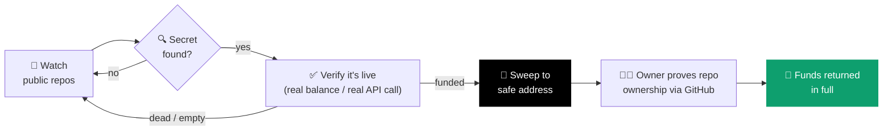

# Aegis

**A whitehat rescue bot for exposed on-chain funds on Starknet.**

Aegis watches public repos for accidentally committed private keys and API
keys, verifies whether they're actually live and actually holding funds —
not just pattern-matching — and sweeps anything real to a safe address
before an attacker gets there first.

[](https://aegis-peach-six.vercel.app/)
[](https://strk20.starknet.io/hackathon)
[](https://sepolia.voyager.online/)
[](https://nextjs.org)
[](LICENSE)

**[→ aegis-peach-six.vercel.app](https://aegis-peach-six.vercel.app/)**

---

## The problem

Shipping fast means leaking things. A `.env` gets committed, a hardhat
config keeps a real deployer key, a demo repo goes public with a funded
testnet account still inside it. The moment that key is on GitHub, it's
already been scraped — bots harvest leaked keys within minutes.

Aegis is the whitehat version of that bot.

## How it works



1. **Detect** — scans every project registered in the [STRK20 hackathon registry](https://github.com/starkience/strk20-hackathon) for known-sensitive filenames (`.env`, `hardhat.config.*`, `foundry.toml`, …).
2. **Verify** — a leaked string alone isn't a finding. Private keys are checked against real Sepolia balances; GitHub tokens and Alchemy keys get one minimal, read-only call to confirm they're actually live. Nothing gets flagged as urgent unless it's real.
3. **Rescue** — if a leaked key controls real funds, Aegis derives the Starknet account it owns (private keys don't map to one address the way they do on EVM chains — this is solved on-chain, not guessed), deploys the account if needed, and sweeps the balance to a safe holding address.
4. **Return** *(in progress)* — the original owner signs in with the GitHub account that leaked the key, proving control of the repo, and gets the funds back.

No human in the loop between detection and rescue — the whole thing runs on page load, and (once deployed) on a schedule via Vercel Cron, so it keeps working even if nobody's looking at the site.

## Why privacy matters here

A sweep-and-return service is only as safe as its own holding address. A
transparent wallet is a target — anyone watching the mempool can front-run
the rescue or drain it the moment it's known publicly. Routing rescued
funds through the STRK20 shielded pool removes that window: the holding
balance isn't linkable on-chain, and payout to a verified owner is a
private transfer, not a public, front-runnable one.

## What's actually working right now

- ✅ Live registry scan across every hackathon-registered repo
- ✅ Verified detection (real balance checks, real credential liveness checks — not just regex)
- ✅ Private-key → funded-account derivation with zero manual input
- ✅ Automatic sweep to a safe address, tested end-to-end on Sepolia with real funds
- 🚧 GitHub-verified claim/payout flow
- 🚧 Routing rescued funds through the STRK20 shielded pool (currently a plain transfer)

## Stack

- **Next.js 16** (App Router) + TypeScript
- **starknet.js v10** — Sepolia RPC, account derivation, deploy + sweep
- **next-auth v5** — GitHub OAuth for the upcoming claim flow
- **Tailwind CSS**

## Running locally

```bash
npm install
cp .env.example .env.local     # add your Alchemy Starknet RPC key + a safe address
npm run dev                    # http://localhost:3000
```

Without an Alchemy key, the scanner still detects leaked secrets but skips
balance checks and rescues.

## Credits

UI built on top of the [STRK20 starter kit](https://github.com/Akashneelesh/strk20-starter-kit) (MIT).

## License

MIT, see [LICENSE](LICENSE).
